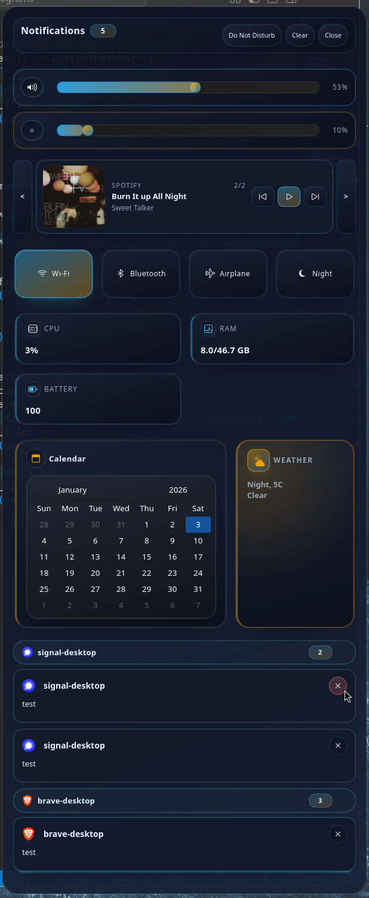

# UnixNotis



UnixNotis is a Wayland-first notification system with a control-center panel and toast popups.
It includes a D-Bus daemon that implements the Freedesktop.org notification spec and GTK4
frontends for the panel and popups.

## Features

- Freedesktop.org notification daemon with history, rules, sound, and DND.
- Control-center panel with widgets, notification list, and media controls.
- Toast popup UI with configurable timeouts and styling.
- MPRIS media integration with playback controls.
- Hot-reloaded config and CSS for fast iteration.
- CLI control via `noticenterctl`.

## Components

- `unixnotis-daemon`: D-Bus notification service, state store, history, and lifecycle control.
- `unixnotis-center`: Control-center panel UI with widgets, media controls, and notification list.
- `unixnotis-popups`: Toast popup UI for transient notifications.
- `noticenterctl`: CLI helper to open/close the panel and send control actions.
- `css-check`: Helper binary used by the center to validate CSS during reloads.

## Performance and optimization focus

- Event-driven watchers for toggles and sliders when possible.
- In-process readers for common stats to avoid shell spawns.
- Command budgeting with timeouts, concurrency limits, and jitter.
- Icon and media caching to avoid repeated decoding.
- Watchers paused when the panel is closed to avoid background load.

## Requirements

- Wayland session (panel UI requires Wayland compositors).
- GTK4 and gtk4-layer-shell libraries.
- D-Bus session bus.
- Rust toolchain for builds.
- Optional external commands used by widgets and watchers:
  - `nmcli` for NetworkManager toggles
  - `bluetoothctl` for Bluetooth toggles
  - `udevadm` for rfkill events
  - `pactl` for audio subscription events

## Build

```sh
cargo build --release
```

## Quick start (no systemd install)

Running with `cargo run --release` is a safe way to preview behavior without installing user
services. If a user service is already running, stop it first so the D-Bus name is available.

```sh
cargo run --release -p unixnotis-daemon
```

```sh
cargo run --release -p unixnotis-center
```

```sh
cargo run --release -p unixnotis-popups
```

Open or close the panel using the CLI:

```sh
cargo run --release -p noticenterctl -- open-panel
cargo run --release -p noticenterctl -- close-panel
```

## Configuration

The default config path follows XDG conventions:

- `$XDG_CONFIG_HOME/unixnotis/config.toml`
- fallback: `$HOME/.config/unixnotis/config.toml`

If the config file is missing, defaults are used. Theme files are stored alongside the config
directory and are created on demand.

### Removing widgets

Widgets can be removed either by disabling their flags or removing entries from the widget lists:

```toml
[widgets.volume]
enabled = false

[widgets.brightness]
enabled = false

[[widgets.toggles]]
enabled = false
label = "Wi-Fi"

[[widgets.stats]]
enabled = false
label = "CPU"

[[widgets.cards]]
enabled = false
title = "System"
```

Removing entries from `widgets.toggles`, `widgets.stats`, or `widgets.cards` disables them
entirely. For sliders, set `enabled = false`.

### Styling

CSS is controlled by the theme files under the config directory:

- `base.css`
- `panel.css`
- `popup.css`
- `widgets.css`

The filenames are configurable via the `[theme]` section (`base_css`, `panel_css`, `popup_css`,
`widgets_css`). CSS changes are hot-reloaded.

## Waybar integration

There is no built-in Waybar module. A custom module works well and is simple to configure.
Example snippet for `$HOME/.config/waybar/config`:

```json
{
  "custom/notifications": {
    "exec": "noticenterctl list-active | awk '{print $3}'",
    "interval": 2,
    "on-click": "noticenterctl toggle-panel",
    "tooltip": false
  }
}
```

Example CSS for `$HOME/.config/waybar/style.css`:

```css
#custom-notifications {
  padding: 0 10px;
}
```

## Systemd user units (optional)

No unit files are shipped in the repo yet. Example user unit for the daemon:

```ini
[Unit]
Description=UnixNotis Daemon

[Service]
ExecStart=%h/UnixNotis/target/release/unixnotis-daemon
Restart=on-failure

[Install]
WantedBy=default.target
```

Example user unit for the center panel:

```ini
[Unit]
Description=UnixNotis Center
After=unixnotis-daemon.service

[Service]
ExecStart=%h/UnixNotis/target/release/unixnotis-center
Restart=on-failure

[Install]
WantedBy=default.target
```

## Logging

Log level is controlled by `general.log_level` in the config. Standard `RUST_LOG` overrides apply
when set in the environment.

## Development

```sh
cargo test
cargo clippy --all-targets --all-features -- -D warnings
```

## Troubleshooting

- Panel fails to start: ensure the session type is Wayland (`XDG_SESSION_TYPE=wayland`).
- Icons missing: verify GTK icon themes are installed and the image hints contain valid paths.
- Widget toggles do not update: ensure the optional external commands listed above are available.
